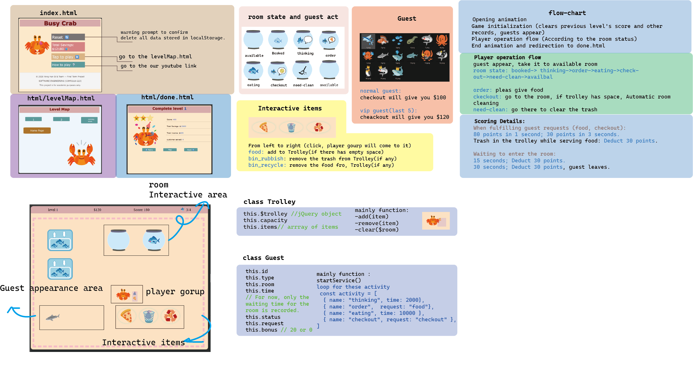

# school_project
# Busy Crab: Deep Sea Restaurant Management Simulation Web Game
# Youtube Link: https://youtu.be/n5XK6-PRQJk
# try to play: https://p2405427.github.io/school_project/index.html
## Graphical Abstract

---

## Purpose of the Software

### Inspiration & Development Goal

This project is inspired by a now-defunct childhood classic management game, *Karaoke Rush*. Since that game can no longer run on modern platforms, this project aims to recreate its core management fun using HTML5 and JavaScript, while adding our team's innovative mechanics (a new penalty system).

### Character & Visual Inspiration

- The main character crab and various marine animal guests are inspired by the animation *SpongeBob SquarePants*, with graphics created using Google Emoji Kitchen.

### Development Model

We adopt the **Agile** model.  
Reason: Real-time feedback is essential for management web games. Iterative testing allows precise tuning of movement speed, animation, and sound synchronization.

### Target Market

- Casual gamers who enjoy simulation/management games on the web  
- Playable directly on PC or mobile browsers (responsive design)

---

## Core Algorithms & Logic

### Main Algorithms

1. **`calculateAndMove()`**  
   Uses the Pythagorean theorem to compute the geometric distance between start and end points, dynamically determining the animation duration to keep movement speed constant regardless of distance (currently speed is still higher on small mobile screens – listed as future improvement).

2. **`moveTo()`**  
   Automatically determines the target position and the character's current floor. If moving across floors, it first goes to the "elevator entrance" on the same floor, then to the "elevator exit" on the target floor, and finally to the destination.

3. **Asynchronous state functions**  
   Implement a linear service workflow, effectively preventing race conditions caused by rapid consecutive clicks, ensuring each interaction is executed precisely in order.

### Main Objects

- `Guest(id, type)`: records the guest's flow after entering a room (activity name, usage time, request event)  
- Cart object (jQuery object, capacity): includes functions for adding/removing items, cleaning rooms, etc.

---

## Software Development Plan

### Development Steps (Timeline)

| Step | Description | finished time |
|------|-------------|----------------------|
| 1 | Initial concept (layout + gameplay) | 0322 |
| 2 | Basic layout (HTML + CSS) | 0324 |
| 3 | Movement system (listeners + `moveTo()` + `calculateAndMove()`) | 0331 |
| 4 | Guest objct & Player operation flow | 0405 |
| 5 | Determine if the game has ended and redirect to the results screen (done.html) | 0406 |
| 6 | RWD basic | 0407|
| 7 | try to write howToPlay.html(./html/howToPaly) | 0410 |
| 8 | basic sound effects & basic UI(guest, food)| 0412|
| 9 | Score system| 0413|
| 10 | Add stars to the rating system [done.html], Beautify level scene elements|0417|
| 11 |Adjustments completed RWD, video|0419|

### Roles & Contribution Percentage

- **Vong Hun Si (p2405427)**: all code, initial concept, artwork (all images `*.ai`) – **100%**  
- Other members (no code contribution): only suggestions for artwork and sound – **0%**

### Current Status

- Completed: movement system, guest service workflow, scoring system, basic sound effects  
- Debugging: cross-device speed compensation, some animation sync issues  
- To be implemented: multi-level system, detailed scoring criteria (see `每關評分標準.txt`)

### Future Work

1. **Cross-device speed normalization**  
   Adjust speed coefficient based on screen width to fix speed inconsistency between mobile and PC.

2. **Upgrade system**  
   Use earned money to upgrade cart capacity, character speed, selling price multiplier, etc.

3. **Multi-level & scoring mechanism**  
   Implement level switching, pass conditions, and star ratings according to `每關評分標準.txt`.

4. **Parameter tuning & balancing**  
   Continuously balance difficulty and player experience based on records in `調整.txt`.

5. **Full sound effects & background music**  
   Add more open-source sounds (BGM, button feedback, level-clear cheers, etc.).

6. **Layout & responsive improvements**  
   Further enhance responsive design according to `切版.txt` and `圖像設計.txt`.

---

## Demo

🎥 **YouTube Video Link** (replace after uploading)  
[Click to watch the game demo](https://youtu.be/your_video_id)

The video includes:  
- How to start the game  
- How to play (movement, serving guests, using the cart)  
- A complete gameplay session (10–15 minutes)

---

## Environments & Dependencies

### Development Environment

- Visual Studio Code (with Live Server)  
- GitHub Pages (for deployment)

### Runtime Requirements

- Minimum hardware: any device that can run a modern browser  
- Software: latest version of Chrome / Edge / Safari, recommended resolution 1920×1080 (responsive)  
- No additional server required – open `index.html` directly or use Live Server

### Packages Used

- **jQuery**: DOM manipulation and high-performance CSS animation control

### Open-Source Sound Effects

The sound effects used in this game come from open-source / free sound libraries:  
- [Freesound.org](https://freesound.org) (search for CC0 or CC-BY sounds)  
- Specific files: `error.mp3`, `開始音` (see repository for exact filenames)  
- Sound license statement: unless otherwise noted, all are under **CC0 1.0 Universal Public Domain Dedication**

---

## Declaration

### Code & Asset Sources

- **Gameplay reference**: *Karaoke Rush* – [YouTube video](https://youtu.be/cZqaCxd2Mgg?si=L_bWNBbuxQ_1ja3I)  
- **Visual inspiration**: *SpongeBob SquarePants*  
- **Game assets**: Google Emoji Kitchen, open-source icons  
- **Sound effects**: from [Freesound.org](https://freesound.org) and self-made – see sound section above  
- **AI assistance**: used for collaborative optimization of complex geometric movement algorithms and CSS keyframe animations

### Internal Documentation Files

The project includes the following auxiliary files (for development reference only, not required for execution):  
- `切版.txt` – layout planning  
- `功能.txt` – feature list  
- `圖像設計.txt` – graphic design notes  
- `每關評分標準.txt` – level scoring details  
- `調整.txt` – balancing adjustment records  
- `軟件工程—遊戲設計.pdf` – design document

### Copyright & License

The source code of this project is licensed under the **MIT License** (see the `LICENSE` file in the repository).  
External open-source assets have been declared above.
